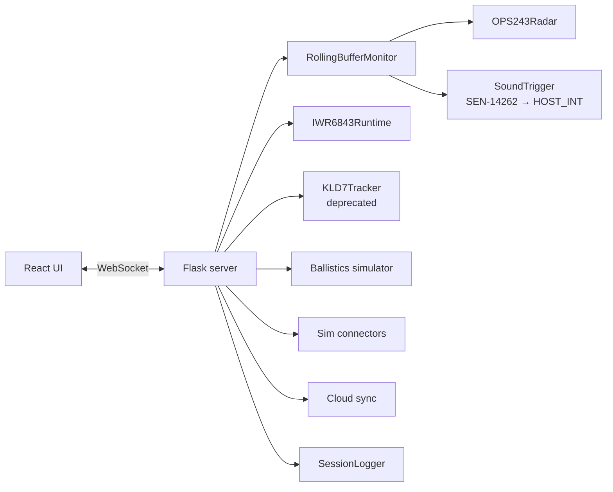

# Measurement Pipeline

## Components

| Module | Responsibility |
| --- | --- |
| `ops243.py` | OPS243 driver, rolling-buffer capture, I/Q transfer |
| `rolling_buffer/processor.py` | FFT, mode-based speed extraction, spin detection |
| `rolling_buffer/` | Trigger strategies |
| `iwr6843/` | TI driver, L3 raw dump parser, LCMF-v1 angle and club path |
| `clubs/` | Built-in club types and immutable physics defaults |
| `launch_monitor.py` | `Shot` dataclass and carry estimation |
| `ballistics.py` | RK4 trajectory with drag and Magnus |
| `inclinometer.py` | LIS3DH tilt compensation |
| `sim/` | Simulator connectors and network transports |
| `cloud/` | Telemetry, config, session upload |
| `server.py` | Flask server, `AppState`, staged shot processing |
| `session_logger.py` | JSONL session logs |

## The sequence

1. **Impact.** The SEN-14262 detects the strike and drives its `GATE` output
   high.

2. **Trigger, twice.** That single edge goes to the OPS243's `HOST_INT` pin
   (hardware, ~10 µs) *and* to the Pi's BCM17. There is no software in the OPS
   path — that is what makes the capture window reliable.

3. **OPS dump.** The radar freezes its rolling buffer and returns 4,096 I and
   4,096 Q samples — 40,556 bytes on the wire.

4. **IWR dump.** The Pi asks the IWR6843 firmware to finish its current frame
   and dump the rolling frame ring.

5. **Speed extraction.** `RollingBufferProcessor` runs a 128-sample FFT
   zero-padded to 4,096 across the capture, building a timeline. Overlapping
   regions separate club, impact, and ball; the club region is the pre-impact
   window, the ball region is post-impact.

6. **Angle extraction.** LCMF-v1 processes the IWR6843 radar cube for vertical
   launch angle, horizontal launch direction, and club path from pre-impact
   frames.

7. **Correlation.** The two captures are matched on the OPS impact timestamp.

8. **Carry.** The [ballistic simulator](ballistics.md) integrates the
   trajectory.

9. **Emit.** The Flask server sends a `shot` WebSocket event to the UI, forwards
   to any connected [simulator](../using/simulator/index.md), and appends to the
   [session log](../reference/session-log.md).

## Why the trigger is hardware

A software trigger would have to poll or interrupt, then command the radar to
freeze — tens of milliseconds at best. At 150 mph a golf ball travels about
2.7 metres in 40 ms, which is well outside the useful capture window.

Wiring `GATE` directly to `HOST_INT` removes software from the decision. The
cost is the [one-time flash-persist step](../setup/rolling-buffer.md): the
OPS243 firmware changes `HOST_INT` behaviour when rolling-buffer mode is entered
at runtime, so the mode has to already be in flash at power-on.

## Timing constraints

| Quantity | Value |
| --- | --- |
| Sample rate | 30,000 samples/s |
| Buffer | 4,096 I + 4,096 Q samples (~136 ms) |
| Dump size | 40,556 bytes |
| Dump time at 230,400 baud | ~1.8 s |
| Dump time at 19,200 baud (factory default) | ~21 s — every capture truncated |

The baud rate is why the [UART migration](../build/ops243-uart.md) negotiates up
to 230,400 rather than accepting the factory default.

## Related

- [Rolling buffer & spin detection](rolling-buffer.md)
- [Session log reference](../reference/session-log.md)
- [Constants](../reference/constants.md)
